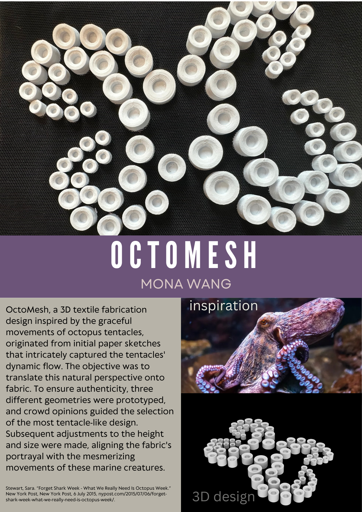

<!--more-->
OctoMesh, a 3D textile fabrication design inspired by the graceful movements of octopus tentacles, originated from initial paper sketches that intricately captured the tentacles' dynamic flow. The objective was to translate this natural perspective onto fabric. To ensure authenticity, three different geometries were prototyped, and crowd opinions guided the selection of the most tentacle-like design.
Subsequent adjustments to the height and size were made, aligning the fabric's portrayal with the mesmerizing movements of these marine creatures.

  

